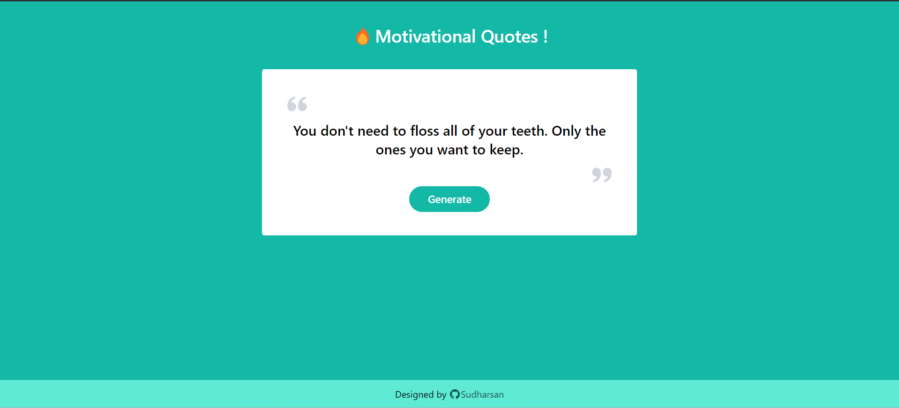

# Advice Generator App

This challenge is part of free internship (Fullstack Engineer) offered by [CyberDude Networks Pvt. Ltd.](https://cyberdudenetworks.com)

> Project #6 : Generate Advices using API

The Advice Generator App is a simple application that fetches and displays random piece of advices. This app offers a user-friendly interface and a quick way to access helpful or entertaining advice.

## Screenshots:

## Live Link:

[Live Link](https://danielace1.github.io/cyberdude-challenges/javascript/02-javascript-DOM/07-advice-generator-app/dist/)

## Features

- _Random Advice_: Obtain random advice with a single button click.
- _User-Friendly Interface_: Enjoy a smooth and easy-to-use experience.
- _API Integration_: Powered by [devfree-resources](https://devfree-resources.netlify.app/app-ideas) for a diverse range of advice.

## Usage

- Clone the repository to your local machine.
- Install Dependencies `npm install`
- Run the App `npm run dev`
- Open in your web browser.

## Contributions:

Contributions are welcome! If you have suggestions, improvements, or bug fixes, feel free to open an [issue](https://github.com/danielace1/cyberdude-challenges/issues/new) or submit a [pull request](https://github.com/danielace1/cyberdude-challenges/pulls).

## Acknowledgement:

🎉 Special thanks to [Anbuselvan Rocky](https://github.com/anburocky3) for his valuable mentorship.

## Author:

- [Sudharsan](https://github.com/danielace1)
