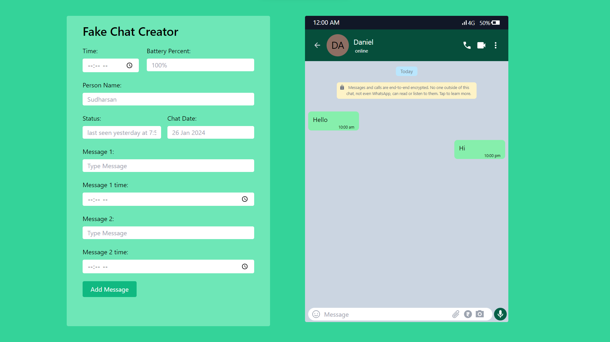

# Fake WhatsApp Chat Creator

This challenge is part of free internship (Fullstack Engineer) offered by [CyberDude Networks Pvt. Ltd.](https://cyberdudenetworks.com)

This is a fake WhatsApp chat creator application built using React and useState. It allows users to generate fake chat conversations for fun and testing purposes.

## Live Link:

[Live Link](https://fake-whatsapp-chat.netlify.app/)

## Screenshots



## Features

- Create fake chat conversations with custom messages and timestamps.
- Simple and intuitive user interface.
- View and manage multiple chat conversations.

# Technologies Used

- React
- JavaScript (ES6+)
- HTML5
- TailwindCSS

# Getting Started

To get started with the project, follow these steps:

1. Clone the repository:

```sh
git clone https://github.com/danielace1/cyberdude-challenges
```

2. Navigate to the project directory:

```sh
 cd javascript/03-react-js/03-fake-whatsapp-chat/
```

3. Install dependencies:

```sh
npm install
```

4. Start the development server:

```sh
npm run dev
```

5. Open your browser and visit `http://localhost:3000` to view the application.

# Contributions

Contributions are welcome! If you'd like to contribute to the project, please [fork](https://github.com/danielace1/cyberdude-challenges/fork) the repository and submit a [pull request](https://github.com/danielace1/cyberdude-challenges/pulls).

## Acknowledgement:

🎉 Special thanks to [Anbuselvan Rocky](https://github.com/anburocky3) for his valuable mentorship.

## Author:

- [Sudharsan](https://github.com/danielace1)
